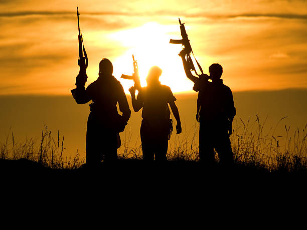

# Global-terrorism-Analysis
# 1) Objective:
Terrorism is The calculated use of unlawful violence or threat of unlawful violence to inculcate fear; intended to coerce or to intimidate governments or societies in the pursuit of goals that are generally political, religious, or ideological.

*   As a security/defence Analyst find out the hot zone of terrorism and derive some security issues.
*   Perform Analyis on hostorical data available on terrorism and derive the insights from it also giving some suggestions so that the countries can control the harms from terrorism.
# 2) Data Description:
The dataset contains the data of approximatly 1,80,000 terrorist attacks happend in all around the world.
Dataset contains data of terrorism from 1970 to 2017.
Include systomatic data on domestic as well as international terrorist incidents that have occoured during specific time period.

# 3) Conclusions:
1.   Inspite of all security measures taken by countries, No of attacks are increacing year by year, And in 2014(16903)it was highest.
2.   Most of the time attacking method is Bombing/Explosion used in 88255 attacks followed by Armed Assault used in 42669.
3.   Most of the time Targets is Private Citizens & Property(43511) followed by Military(27984).
4.  Most of the time Target Region is Middle East and North Africa followed by South Asia.
5. 15 Most Targeted Contries is shown in plot,Top most is Iraq(24636), followed by Pakistan(14368), India(11960) is in 4th number.
6.  15 Most Active Terroriest Groups is shown in plot,where most of group names are Unknown(82782) followed by Taliban(7478) and ISIL(5613).
7. 15 Most Used Wepons are shown in plot,where most used wepon is Explosive (92426)followed by firearms(58524).
8. After 2010 Terroriest activity has been drastically increased in middle east and north africa and also in south Asia.
9. Most of the casulties are seen in middle east and north africa region((351950) and Country Iraq(213279).
10. Highest casualty happend in year 2014(85618) followed by 2015(82896).
11. Total properties destroyed in Middle East & North Africa is 111549 due to terroriest attacks , Followed by South Asia(69278) also Total properties destroyed in iraq is 68639, Followed by Afghanistan(21997).
12. Total properties destroyed in 2014 is highest in all of the world  i,e 35610.
13. Highest attackes are done in month May i,e 16875.
14. The most corelated columns are killed, Wounded and Casualties.
